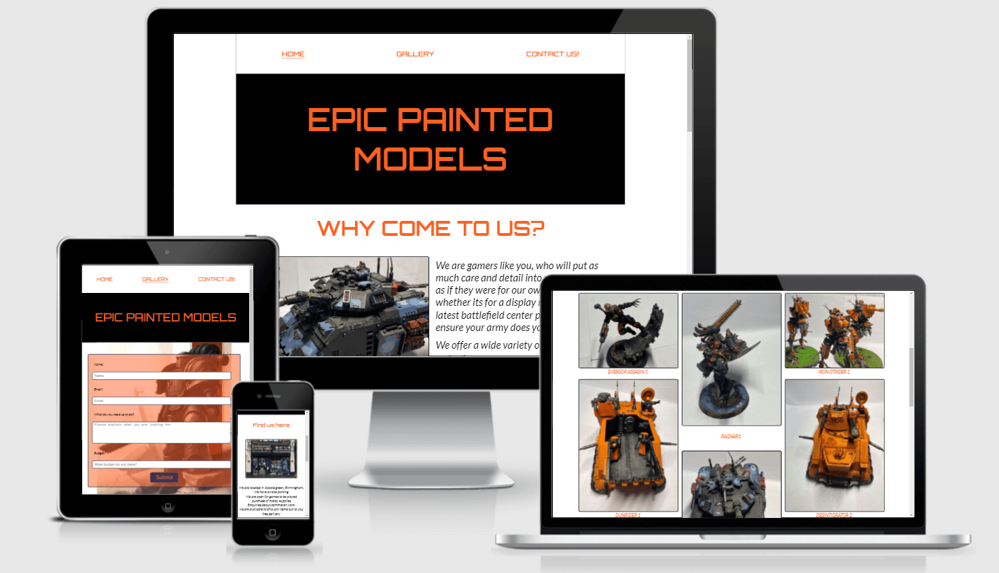
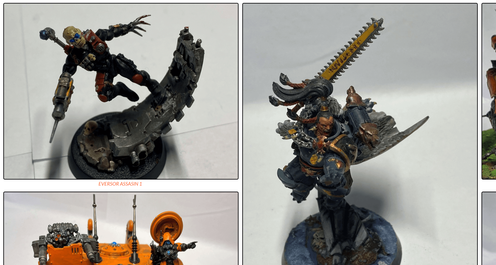

# Epic painted model

## Contents

* Reasons for this project
* UX
* User stories
* Logo
* Future builds
* Build status
* Deployment
* Wire frame
* Languages
* Libraries and other technologies
* Testing
* Bugs
* Citations

## Reason for this project 

This site will be used to help pepromote demonstrating minatures people have painted and allow commisions to be arranged or just to show case their work.

## UX

This site is designed to advertise a store where people are able to visit in order to request painting commisions done for there models, they will also be able to purchase advertised projects.

### Logo

## Future builds 

The site will be intended to facilitate sales, bids on already painted models and a funtion to allow commissions to be made with more ease, eg. Allow people to select amount of models quality of painting when the commision should be achieved by and allow the person fulfilling the commission to quote accordingly.

Depending on how many users it may be feasable to allow a function to allow people to search through different commissioners

## Site responsiveness

## Features

Gallery page is created in a mosaic grid form

Buttons are used to allow you to navigate to different parts of the site

A navbar is utilised to aid website navigation

## Deployment

This project was developed using Gitpod IDE and pushed to Github using the in-built terminal.
This project was deployed from the Github Respository to GitHub Pages using the following steps:

Log into Github.
* Select the https://github.com/steveforrest/portfolio-project-1 respository.
* Click the settings tab.
* Scroll to the GitHub Pages section of the page.
* Under the source heading select the master branch option.
* Click save.
* The project has now been deployed. Scroll back to the GitHub pages section and click on the link above the source heading to view the live site.

Making a clone to run locally
* Log into GitHub.
* Select the repository.
* Click the Code dropdown button next to the green Gitpod button.
* Download ZIP file and unpackage locally and open with IDE. Alternatively copy the URL in the HTTPS box.
* Open the alternative editor and terminal window.
* Type 'git clone' and paste the copied URL.
* Press Enter. A local clone will be created.

## WireFrame 

#### Landing Page wireframe

Home page wireframe where you will first come to when searching for the site

#### Gallery page Wireframe

Gallery page wireframe where you will See all images that are able to be bought clicking on the image will take to a new tab where the image is larger or on the name to a new tab where you can message the seller

#### Enquiry form Wireframe

contact form page wireframe where you will be able to enter details in with an enquiry so that the seller can respond

#### Who we are contact form Wireframe

Who we are is a page where you will be able to find out some details about the physicalk place with details like location and a map

## Languages

* [HTML5](https://en.wikipedia.org/wiki/HTML5)
* [CSS3](https://en.wikipedia.org/wiki/CSS)

## Libraries and Other programns / sites

* [Google Fonts](https://fonts.google.com/)
* [Font Awesome](https://fontawesome.com/)
* [GitHub](https://github.com/)
* [Balsamiq](https://balsamiq.com/)

## Testing

* [W3C HTML Validator](https://jigsaw.w3.org/css-validator/#validate_by_input)
* [W3C CSS Validator](https://jigsaw.w3.org/css-validator/#validate_by_input)
* Responsiveness was tested in dev tools on google chrome, microsoft edge, mozilla and firefox. The site was also tested live on iphoneX safari, amazon kindle fire10 and widows desktop.
* Testing was conducted by
  1. Using dev tools responsiveness was tested by reducing the horizontal screen size
  2. the device setting was selected and then the orientation was changed
  3. All navigational links were checked by clicking on them
  4. buttons were selected to see if you were taken to the correct place
  5. forms were filled out to see if each required field worked as intended and if you were taken to the dump page.

## Bugs

### Home page sections

On the home page the first section would not perform as intened taking into account the justify content parameter of the class attached.
I used unauthordox code in order to get the lower section to act as intended and used <li> to group the actual list which was nested inside the parent nest in order to get the image to sit next to the nested lists correctly.

### Gallery images

The images should line up so images in land scape or portrait are next to each other. I considered using Grid for this but was unable to learn and impliment it due to time constraints.

## Citations

[Spikeybits.com](https://www.pinterest.co.uk/pin/491455378086406395/?d=t&mt=login) taken for contact for back ground image

