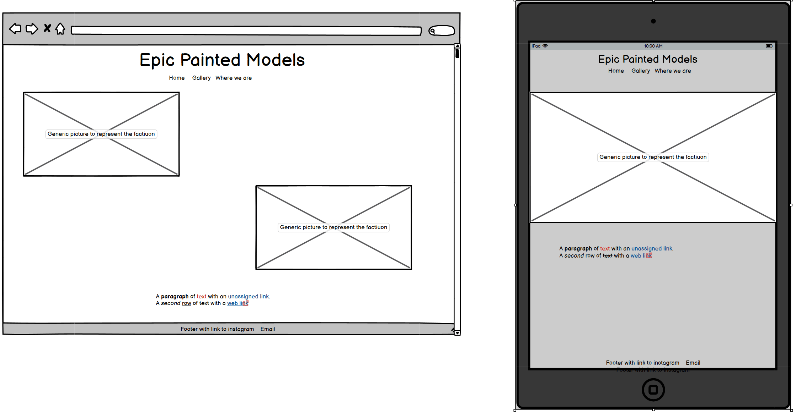
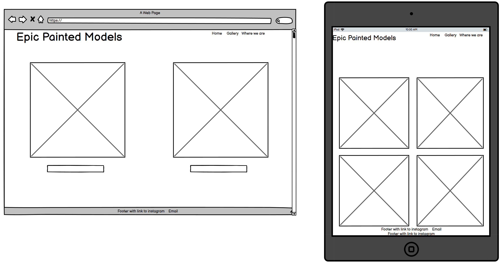
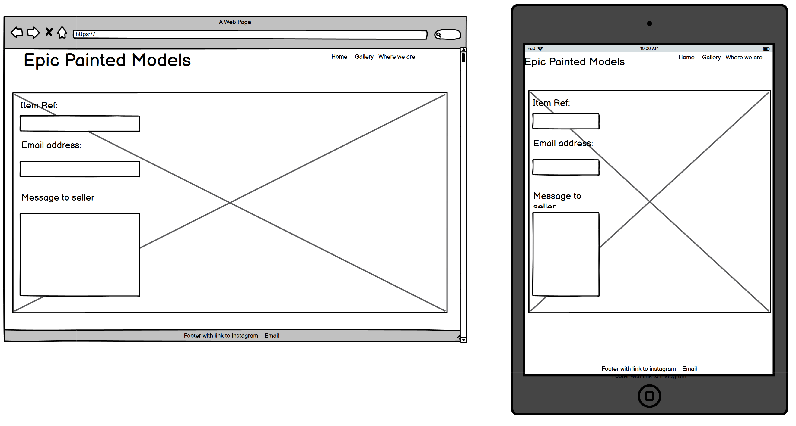
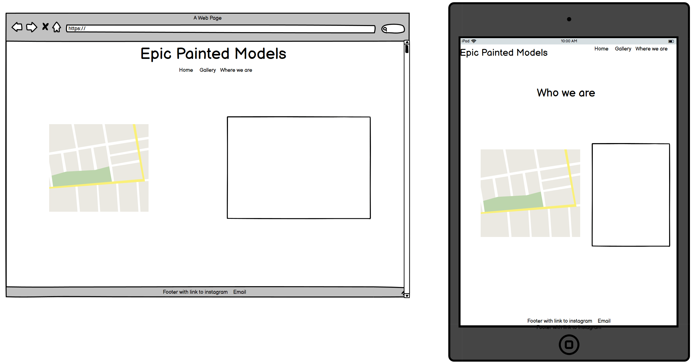

# Epic painted model

## Contents

* Reasons for this project
* UX
* User stories
* Logo
* Future builds
* Build status
* Wire frame
* Languages
* Libraries and other technologies
* Testing
* Screenshots of site
* Citations

## Reason for this project 

This site will be used to help pepromote demonstrating minatures people have painted and allow commisions to be arranged or just to show case their work.

## UX

This site is designed to advertise a store where people are able to visit in order to request painting commisions done for there models, they will also be able to purchase advertised projects.

### User stories

As a user i would like to -
* find examples of commisions that match what they are looking for 
* easily message commissionersto make an enquiry about their work
* easily message commisioners in order to purchase displayed work
* find out where the store is as you may not want work posted

### Logo

## Future builds 

The site will be intended to facilitate sales, bids on already painted models and a funtion to allow commissions to be made with more ease, eg. Allow people to select amount of models quality of painting when the commision should be achieved by and allow the person fulfilling the commission to quote accordingly.

Depending on how many users it may be feasable to allow a function to allow people to search through different commissioners

## Build Status 

Under construction.

## WireFRame 

#### Landing Page wireframe

Home page wireframe where you will first come to when searching for the site

#### Gallery page Wireframe

Gallery page wireframe where you will See all images that are able to be bought clicking on the image will take to a new tab where the image is larger or on the name to a new tab where you can message the seller

#### Enquiry form Wireframe

contact form page wireframe where you will be able to enter details in with an enquiry so that the seller can respond

#### Who we are contact form Wireframe

Who we are is a page where you will be able to find out some details about the physicalk place with details like location and a map

## Languages

* [HTML5](https://en.wikipedia.org/wiki/HTML5)
* [CSS3](https://en.wikipedia.org/wiki/CSS)

## Libraries and Other programns / sites

* [Google Fonts](https://fonts.google.com/)
* [Font Awesome](https://fontawesome.com/)
* [GitHub](https://github.com/)
* [Balsamiq](https://balsamiq.com/)

## Testing

* [W3C HTML Validator](https://jigsaw.w3.org/css-validator/#validate_by_input)
* [W3C CSS Validator](https://jigsaw.w3.org/css-validator/#validate_by_input)
* Responsiveness was tested in dev tools on google chrome, microsoft edge, mozilla and firefox. The site was also tested live on iphoneX safari, amazon kindle fire10 and widows desktop.

## screen shot of site

## Citations

[Spikeybits.com](https://www.pinterest.co.uk/pin/491455378086406395/?d=t&mt=login taken for contact for back ground image)

